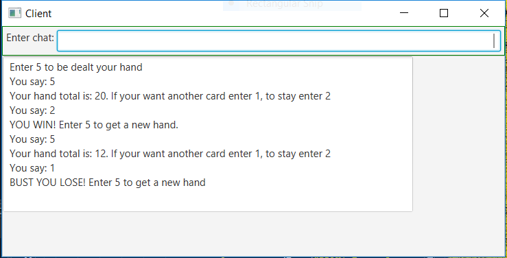

# BlackJack

Create a program in which a user plays a simple version of the card game 21 against the computer. The computer will run a network server process allowing client players to connect. Each player is initially dealt two cards from a standard deck of 52. Random numbers will represent the cards from 1 to 10. After seeing their hand the user then the house (computer) are given the opportunity to take additional cards (hit me). The hand that comes the closest to 21 without exceeding 21 wins the game. A draw results if both players have the same score.

## Example Output

This image will display as your example output. Name the image README.jpg in your project folder.

## Analysis Steps

I used an earlier client server program for the basis of this assignment and classes to handle the deck and cards

### Design

I used the server class as the main then I used a card class to define the cards, and a deck class to create the decks
I used the server to draw and do all the work for finding who won, woh lost and check if the player went over 21 or got 21
Then the server would send a number to the client and the client would use that number to display the correct output for the player.

### Testing

I made some debug statements to see if the deck would shuffle correctly or deal correctly and display that in a println
I also just played the game to see if it was adding correctly and checking if the server would send the correct number to the client

## Notes

Explain any issues or testing instructions.

## Do not change content below this line
## Adapted from a README Built With

* [Dropwizard](http://www.dropwizard.io/1.0.2/docs/) - The web framework used
* [Maven](https://maven.apache.org/) - Dependency Management
* [ROME](https://rometools.github.io/rome/) - Used to generate RSS Feeds

## Contributing

Please read [CONTRIBUTING.md](https://gist.github.com/PurpleBooth/b24679402957c63ec426) for details on our code of conduct, and the process for submitting pull requests to us.

## Versioning

We use [SemVer](http://semver.org/) for versioning. For the versions available, see the [tags on this repository](https://github.com/your/project/tags). 

## Authors

* **Billie Thompson** - *Initial work* - [PurpleBooth](https://github.com/PurpleBooth)

See also the list of [contributors](https://github.com/your/project/contributors) who participated in this project.

## License

This project is licensed under the MIT License - see the [LICENSE.md](LICENSE.md) file for details

## Acknowledgments

* Hat tip to anyone who's code was used
* Inspiration
* etc
